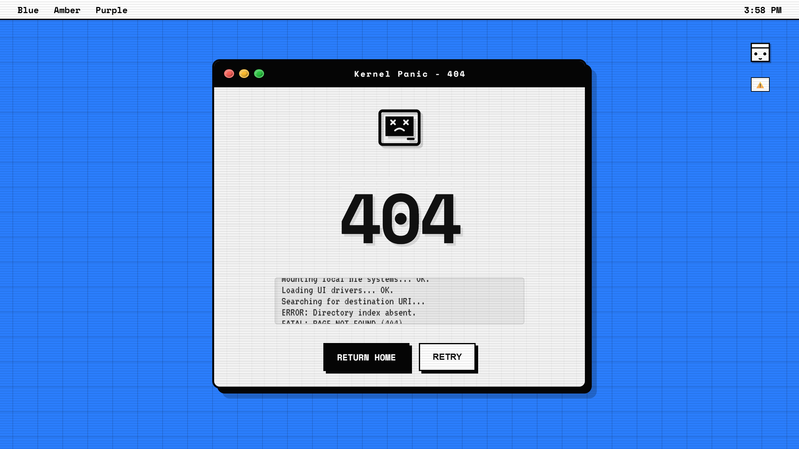
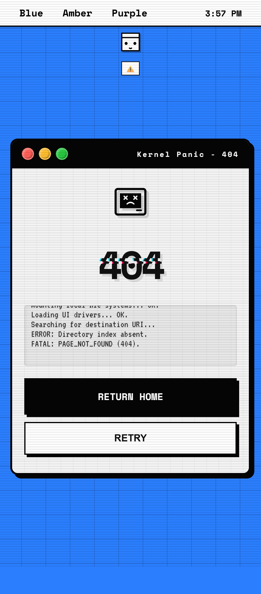

<div align="center">
  
  
  
  

  <h1><a href="https://viratiakiranandhanreddy.github.io/404-retro-window">404-retro-window</a></h1>
  <p><em>A nostalgic, interactive 404 error page with classic system window styling and color controls.</em></p>
</div>

---

## **🖥️ Why 404-retro-window?**

**404-retro-window** is a **minimalist, retro-inspired 404 error page** that captures the charm of classic operating systems from the 90s and 2000s.

Instead of generic error messages, users encounter:

* 🎨 **Interactive color controls** – Click the title bar dots to change the background
* 🪟 **Authentic window design** – Inspired by macOS and classic system dialogs
* 😢 **Friendly sad face** – A charming SVG companion to your 404 message
* ⚡ **Zero dependencies** – Pure HTML, CSS, and vanilla JavaScript
* 📱 **Fully responsive** – Works beautifully on desktop, tablet, and mobile
* 🎯 **Retro grid background** – Pixel-perfect nostalgic aesthetic

Perfect for developers who appreciate **design details** and want their 404 pages to make users smile instead of cringe.

---

## **📸 Preview**

| Desktop | Mobile |
|------|---------|
|  | |

## Color Controls 

https://github.com/user-attachments/assets/021f16c6-458b-4bbd-906a-994a75f00cef

---

## **✨ Features**

### **1. System Window Design**
* Authentic black title bar with rounded corners
* Draggable-style window chrome (visual only, no JS drag required)
* Grid-patterned retro background
* Shadow and depth effects that pop

### **2. Interactive Color Picker**
* Click the **red**, **yellow**, or **green** dots in the title bar
* Instantly change the background color
* Smooth CSS transitions for polish
* True-to-life macOS aesthetic

### **3. Centered Sad Face Icon**
* Beautiful SVG smiley face
* Positioned above the 404 text
* Responsive sizing that scales with viewport
* Adds personality to the error page

### **4. Clean Typography**
* Space Mono monospace font for that authentic retro feel
* Bold, readable 404 text with responsive sizing
* Professional sub-text explaining the situation
* Clear call-to-action button

### **5. Mobile Optimized**
* Responsive grid background
* Mobile-friendly button placement
* Touch-friendly color controls
* Scales gracefully on all screen sizes

### **6. One-File Deployable**
* No build process
* No dependencies
* No frameworks
* Just rename to `404.html` and deploy

---

## **🚀 Live Demo**

<kbd>**[/404-retro-window/](https://viratiakiranandhanreddy.github.io/404-retro-window/)**</kbd>

---

## **🛠️ Installation & Setup**

### **1. Clone the Repository**

```bash
git clone https://github.com/ViratiAkiraNandhanReddy/404-retro-window.git
```

### **2. Use as GitHub Pages 404**

Rename the file to `404.html`:

```bash
mv index.html 404.html
```

Push it to the **root of your GitHub Pages repository**.

GitHub Pages automatically serves `404.html` for all invalid routes.

### **3. Or Deploy Anywhere**

Simply upload the files to your web server:
- `index.html` (or `404.html`)
- `css/styles.css`
- `js/script.js`

---

## **🎨 Customization**

### **🔹 Change the Error Message**

Open `index.html` and modify the heading:

```html
<h1>404</h1>
```

Replace with any message like `"LOST"`, `"ERROR"`, `"OOPS"`, etc.

---

### **🔹 Modify the Subtitle**

```html
<div class="sub-text">The page you are looking for has vanished.</div>
```

Customize the error description to match your brand voice.

---

### **🔹 Change Default Background Color**

In `css/styles.css`:

```css
:root {
  --bg-color: #2b7fff;  /* Change this hex color */
  --window-bg: #f9f9f9;
  --border-color: #000000;
}
```

---

### **🔹 Add Custom Color Controls**

In `index.html`, add new color buttons:

```html
<button class="color-dot purple" title="Purple" onclick="changeColor('#9d4edd')"></button>
```

Then add the CSS in `styles.css`:

```css
.purple {
  background-color: #9d4edd;
}
```

---

### **🔹 Modify the Sad Face Icon**

Replace the SVG in `index.html` with any icon you prefer. The current sad face uses Feather Icons format.

---

### **🔹 Adjust Grid Background**

Change the grid size in `css/styles.css`:

```css
background-size: 40px 40px;  /* Adjust to your preference */
```

---

## **📁 Project Structure**

```
404-retro-window/
├── index.html              # Main HTML file
├── css/
│   └── styles.css         # All styling
├── js/
│   └── script.js          # Color change functionality
├── LICENSE
└── README.md
```

---

## **♿ Accessibility**

* Semantic HTML structure
* Proper color contrast ratios
* Keyboard accessible button
* Descriptive title tags
* Mobile-friendly viewport settings

---

## **🧪 Browser Support**

* ✅ Chrome/Edge (latest)
* ✅ Firefox (latest)
* ✅ Safari (latest)
* ✅ Mobile browsers (iOS Safari, Chrome Mobile)
* ⚠️ IE11 not supported (uses CSS variables & ES6)

---

## **💡 Tips & Tricks**

### **Pro Tips for Integration**

1. **Customize for your brand** – Change colors, fonts, and message to match your site
2. **Add more color options** – Users love interactive elements
3. **Test on mobile** – Use device pixel ratio for sharp displays
4. **Fast load times** – This is already optimized and loads instantly

---

## **🤝 Contributing**

Contributions are welcome! Feel free to:

1. Fork the repository
2. Create a feature branch (`git checkout -b feature/your-feature`)
3. Commit your changes (`git commit -am 'Add cool feature'`)
4. Push to the branch (`git push origin feature/your-feature`)
5. Open a Pull Request

---

## ⭐ Support

<kbd>If you like this project, please give it a ⭐ star — it helps a lot and motivates continued development!</kbd>

---

## 📝 License

<p align="center"><kbd>&copy; 2026 <a href="https://github.com/ViratiAkiraNandhanReddy">ViratiAkiraNandhanReddy</a>. This project is licensed under the <i>MIT License</i>.</kbd></p>

---

## 👤 Author

### Developed by [ViratiAkiraNandhanReddy](https://github.com/ViratiAkiraNandhanReddy)

> 🎨 Created with a passion for retro design and user experience. Making error pages awesome since 2025.

> 💤 - PASSIVE MAINTENANCE : Mean the project is no longer actively developed ***( NO New Features And Regular Updates )***, but the maintainer will respond only when an issue or PR is raised. Feel free to fork and continue development!


---

<h3 align="center">🌟 Love retro design? Show your support by starring this repo! 🌟</h3>

<p align="center"><strong>Have questions or suggestions? Open an issue on GitHub!</strong></p>

<p align="center"></p>
